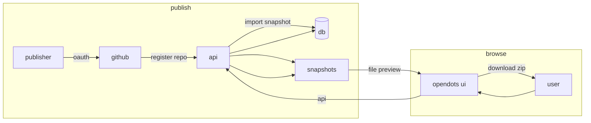

<p align="center">
  <a href="https://opendots.me">
    
  </a>
</p>

<p align="center">a public directory for opencode configuration bundles: find, preview, and install community configs.</p>

<p align="center">
  <a href="LICENSE"></a>
  <a href="https://opendots.me"></a>
  <a href="https://vercel.com/"></a>
</p>

<p align="center">
  
</p>

---

## what

opendots is a directory for opencode configuration bundles.

instead of copy-pasting random dotfiles from github, you can:

- browse bundles and see exactly what they contain
- preview files before downloading
- download a zip ready for project or global install
- see basic safety signals (not a guarantee, but better than nothing)

## quick links

- website: https://opendots.me
- browse: https://opendots.me/browse
- docs: https://opendots.me/docs
- publish: https://opendots.me/publish.md
- install: https://opendots.me/install.md

## how it works



publishers connect github, register a repo, and opendots imports a snapshot. visitors browse bundles, preview files, and download zips.

## features

- bundle pages with file tree + syntax-highlighted previews
- downloads for project (`.opencode/`) or global (`~/.config/opencode/`) install
- github oauth for publishers
- repo import with snapshots (stable browsing without live github fetches)
- basic safety signals: config validation, theme validation, risk flagging
- claim codes for verifying repo ownership

## local dev

```bash
# install dependencies
npm --prefix frontend install
npm --prefix backend install

# run dev servers
npm --prefix frontend run dev   # http://localhost:5173
npm --prefix backend run dev    # http://localhost:8788
```

copy `frontend/.env.example` to `frontend/.env` and `backend/.env.example` to `backend/.env`.

for production env vars, see `DEPLOY.md`.

## project structure

```
opendots/
├── frontend/          # web ui (vite + react)
├── backend/           # api (fastify + drizzle)
└── api/               # vercel function entrypoint
```

## stack

- frontend: react 19, vite, motion, gsap, three.js
- backend: fastify 5, better-auth, drizzle, sqlite/turso
- deployment: vercel

## troubleshooting

| problem | fix |
|:---|:---|
| "no bundles showing" | ensure backend is running and database is migrated |
| auth not working | check `BETTER_AUTH_SECRET` and `GITHUB_CLIENT_ID/SECRET` env vars |
| download fails | ensure snapshot storage is writable |
| frontend not loading | check vite proxy config in `frontend/vite.config.ts` |

## license

mit

<p align="center">
  <a href="https://github.com/microck/opendots">github</a> ·
  <a href="https://opendots.me">website</a> ·
  <a href="https://opendots.me/docs">docs</a>
</p>
